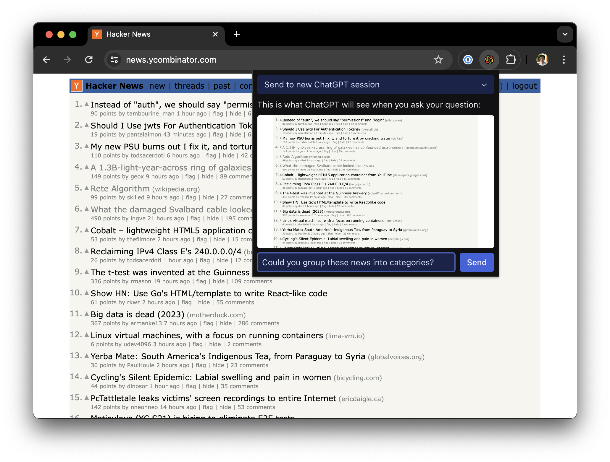
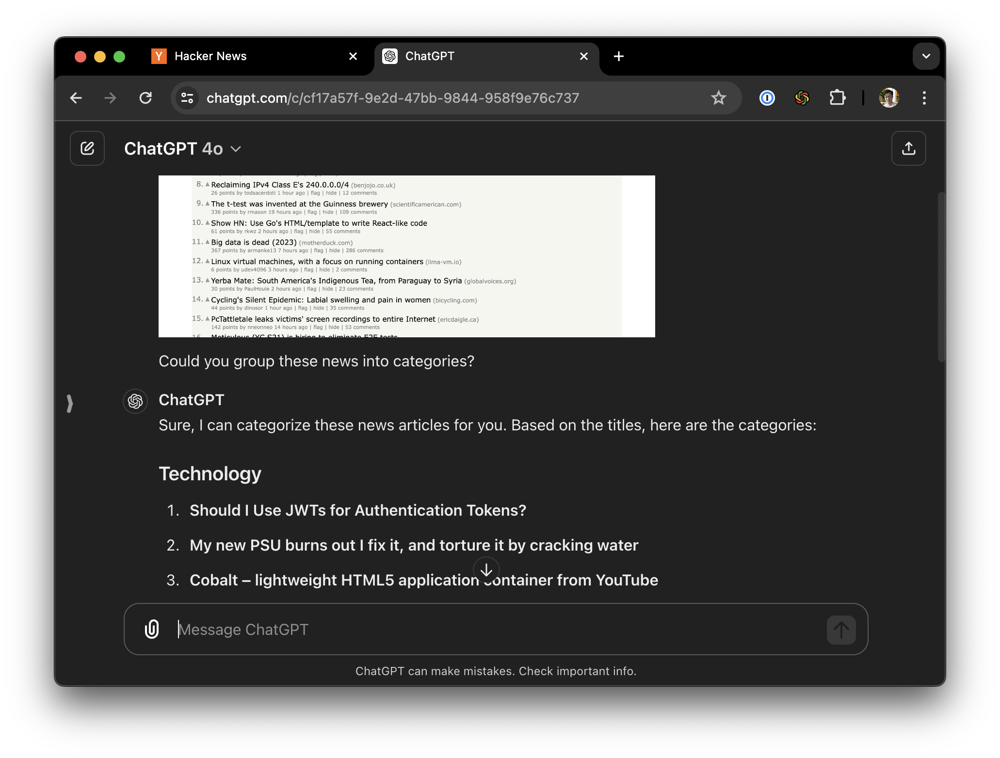

# ChromeGPT

## Installation

1. Go to the latest release under [**Releases**](https://github.com/blitzsprinter/ChromeGPT/releases)
2. Download **ChromeGPT.zip** and unzip it
3. In Google Chrome:
   1. Go to **Manage Extensions**
   2. Enable **Developer Mode**
   3. Click **Load Unpacked Extension**
   4. Select the **ChromeGPT** folder that you unzipped
4. The extension should now be available!

> [!NOTE]
> Installing an extension via Developer Mode bypasses review and security
> measures. I vouch for the code in this repository not doing anything
> malicious, but it’s always a good idea to carefully review the code before
> running it, since this extension is able to inject code into, and take
> screenshots of, all of your browser tabs. That said, a surprising number of
> extensions are able to do this, so always be careful!

## How it works

This Chrome extension will be able to take a screenshot of any of your tabs, and
then send the screenshot to ChatGPT, optionally with an associated message (if
you don’t write anything, it defaults to “Describe this image”).

To open it, you can press <kbd>Alt</kbd>+<kbd>C</kbd> /
<kbd>Option</kbd>+<kbd>C</kbd>. This is what it looks like:

To send the query to ChatGPT, hit Enter. If you already have a ChatGPT tab open,
you can pick it in the dropdown. The extension will send the image off to
whichever ChatGPT tab you chose and switch to that tab, wait for the image to
upload, then send your message:

### For developers

More concretely, this extension injects a bit of JavaScript that finds a
`<textarea>`, sends it a fake `paste` event containing the image as a `File` and
then a fake `input` event with the text. Then it waits for up to one minute to
see if the button with `data-testid*="send-button"` becomes enabled, and
proceeds to click it when it does.

For the most part this has been stable, but I did recently notice that some
versions of the ChatGPT UI have `data-testid="fruitjuice-send-button"` while
others have `data-testid="send-button"`. For this reason I’ve tried to make the
code flexible to renames like these.
